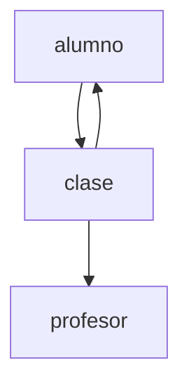

## VAQU 
# Tabla de Contenidos
1. [Introducción](#Introducción)
2. [Pre-requisitos](#Pre-requisitos)
3. [Instalación](#Instalación)
4. [Documentación](#Documentación)
5. [Equipo de Trabajo](#team)
6. [Conclusión](#end)
## Introducción
VAQU es una aplicación web desarrollada con el objetivo de gestionar clases particulares. Los alumnos podrán reservar clases y los profesores subir, editar y eliminar sus clases.
## Pre-requisitos
1. Sistema operativo: Windows
2. Frameworks:
* [Express](https://expressjs.com/es/)
* [React](https://es.reactjs.org/)
3. Conocimientos:
* [JavaScript](https://www.javascript.com/)
* HTML
* [React](https://es.reactjs.org/)
## Instalación
A continuación se detallara una guía de los comandos que se deben usar para comenzar la ejecución.
- En el back-end (res-api):
```console
$ npm install
$ npm run dev
```
- En el front-end (tpo):
```console
$ npm install -g webpack
$ npm install -g react
$ npm install -g react-dom
$ npm install
$ npm run
```
## Documentación
A continuación, se detallará la documentación del proyecto. 
#### Función de cada file
1. Componentes:
- Card-> Contiene una card con la descripción de una clase que visualizará un alumno.
- CardContratacion-> Contiene una card que permite a un alumno inscribirse a una clase.
- CardExtendida-> Contiene una card con la descripción (extendida) de una clase que visualizará un alumno.
- CardExtendidaProfesor-> Contiene una card con la descripción (extendida) de una clase que visualizará un profesor.
- Comentarios-> Contiene el formato de los comentarios.
- Filtro-> Contiene los filtros de las clases y la lógica de los mismos.
- Iniciosesion-> Contiene una card que permite a un alumno iniciar sesión.
- IniciosesionProfesor-> Contiene una card que permite a un alumno iniciar sesión.
- NuevaClase->  Contiene una card que permite a un profesor crear una clase.
- OlvideContraseña-> Contiene una card que permite cambiar la contraseña a cualquier usuario.
2. Context:
- UserContext-> File para tomar el contexto y poder usarlo posteriormente.
3. Controller:
- Peticiones a las apis mediante el uso de fetch.
4. Pages:
- Alumnoprofe -> page que permite al usuario elegir si ingresa como alumno o como profesor, registrarse como alumno o como profesor y cambiar la contraseña.
- PageAgregarClase-> Page que permite al profesor crear nueva clase.
- PageClase-> Page de una clase en especifico que selecciona un usuario.
- PageHome-> Home Page de la aplicación.
- PageiniciosesionAlumno-> Page para que inicie sesión un alumno.
- PageiniciosesionProfesor-> Page para que inicie sesión un profesor.
- PageMisClases-> Page para que un alumno visualice solo las clases que reservó.
- PageOlvideContraseña-> Page que permite a un alumno cambiar contraseña.
- PageRegistroAlumno -> Page que permite a un alumno registrarse (uilizando fetch).
- PageRegistroProfesor -> Page que permite a un profesor registrasrse (utilizando fetch).
- PrincipalAlumno-> Page que muestra todas las clases a un alumno.
- PrincipalProfesor-> Page que muestra las clases a un profesor (solo las que este crea).
#### BD: MongoDB
- Documento clase:  
```
{  
    _id: <ObjectId>,  
    inscriptos: Array[<ObjectId>],  
    comentario: Array,  
    materia: String,  
    tipo: String,  
    duracion: String,  
    freceuncia: String,  
    costo: Double,  
    calificacion: Double,  
    estado: String,  
    idProfesor: <ObjectId>  
}
```
- Documento alumno:
```
{
	_id: <ObjectId>,
	materias: Array[<ObjectId>],
	nombre: String,
	apellido: String,
	email: String,
	contraseña: String,
	fechaNacimiento: String,
	estudiosCursados: String,
	preguntaVerificacion: String,
	telefonoCOntacto: Number,
	mensajeAlProfesor: String,
	__v: Number
}
 ``` 
- Documento profesor:
```
{
	_id: <ObjectId>,
	nombre: String,
	apellido: String,
	email: String,
	contraseña: String,
	titulo: String,
	experiencia: String,
	__v: Number
}
 ``` 
#### Diagrama de relaciones

#### Documemtación APIS
Para ver la documentacion de las apis, se usó la libreria Swagger. Una vez ejecutado el back-end, en el navegador ingresar http://localhost:4000/docs. Usuario: admin Contraseña: Admin
## Equipo de Trabajo
Proyecto desarrollado por estudiantes de UADE para la materia Aplicaciones Interactivas:
- Facundo Milher
- Valentino Salvi Vichich
## Conclusión
Contenido a desarrollar...
